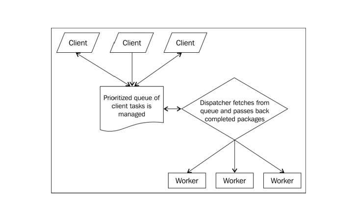

## Understanding Asynchronous Event-Driven Programming

#### Node's Design

- Storing and retrieving data from physical device/disk takes much slower than moving data between solid-state devices such as microprocessors or memory chips, or L2/L3 caches.
- Node was designed to make I/O fast.
- Most worker threads spend their time waiting - for more instructions, subtasks to complete, etc. It utilizes collaborative work environment, where workers are regularly assigned new tasks to do.
  - One way to achieve this goal is to have a pool of available labors, improving efficiency by delegating tasks to different workers as the tasks come in.
  - One drawback: the amount of scheduling and worker surveillance that needs to be done. As a result, the role of dispatcher diminishes since it also has to do bookkeeping and keeping lists.
  - Solution to this - Queue
- Queue acts as a buffer between client and the dispatcher - new worker responsible for managing customer relations.
- Rather than proceeding task-by-task along a single timeline, multiple simultaneous jobs, on their own timelines, run in parallel.

---

#### Understanding the Event Loop

- Important points to remember:
  - The event loop runs in the same thread as our JavaScript runs in. Blocking the event loop means blocking the entire thread.
  - The event loop starts as soon as the process starts and ends when no further callbacks remain to be performed. The event loop, consequently, may run forever
  - The event loop delegates many I/O operations to `libuv`, which manages these operations (using thread pools), notifying the event loop when results are available. An easy to reason about single-threaded programming model reinforced by efficiency of multi-threading.
- The key design choice made by Node designers was the implementation of an event loop as concurrency manager.
- Even though we wrote our code in JavaScript, we are actually deploying a very efficient multithreaded execution engine while avoiding the difficulties of OS asynchronous process management.

---

#### Phases and Priorities

- Different phases
  - Timers - callbacks deferred to some time in the future
  - I/O callbacks - prepared callbacks returned to the main thread
  - Poll/check - mainly the functions slotted on the stack according to the rules of `setImmediate` or `nextTick`
- Upon entering an event loop, Node, in effect, makes a copy of the current instruction queue (also known as **stack**), empties the original queue, and executes its copy. The processing of this instruction queue is referred to as a **tick**.

---

#### Listening for events

-
